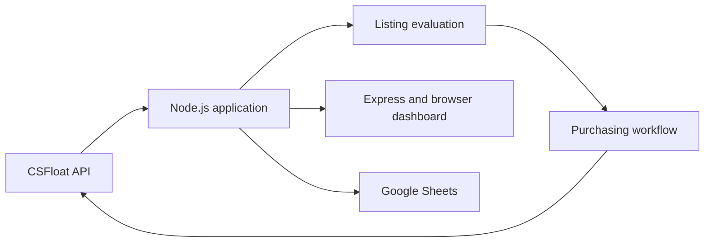

# How the application fits together

[Back to README](README.md)

The application runs on Node.js. It reads market data, evaluates listings against configurable rules, and handles the purchasing workflow. An Express server connects the application to a browser dashboard, and Google Sheets integration supports trade tracking.

## Main pieces

**Market data:** Axios retrieves marketplace information used to evaluate listings and track activity.

**Decision logic:** JavaScript filters evaluate historical prices, sales activity, and market demand. The exact thresholds and pricing rules are private.

**Application controls:** Configurable settings, request-rate tracking, and pause controls help manage operation.

**Dashboard and reporting:** The browser interface displays bot activity and inventory. Google Sheets integration supports tracking purchases, sales, and results.

The diagram shows the main components, not every request or internal dependency. The dashboard is for local use; it is not a public web service.
