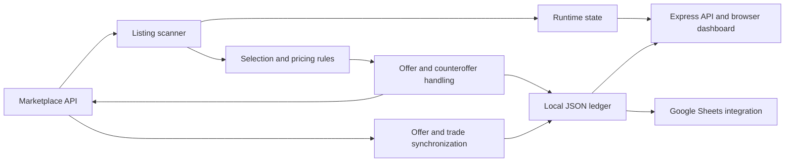

# CSFloat Marketplace Automation

**A personal software project for evaluating marketplace listings, automating purchase negotiations, and tracking trade outcomes.**

Built with **JavaScript · Node.js · Express · Axios · Google Sheets API**

This repository is a public project showcase. The application source code and trading configuration remain private. It contains documentation, not a runnable bot.

## The project

Evaluating marketplace listings manually involves several separate tasks: reviewing market activity, comparing prices, deciding whether an offer is worthwhile, and tracking what happens afterward. This project brings those tasks into a single workflow for the CSFloat digital-item marketplace.

The application retrieves marketplace information, applies configurable selection and pricing rules, submits qualifying offers, and tracks subsequent offer and trade states. A browser dashboard provides operational controls and views of recorded activity, inventory, and calculated trade results.

## My contribution

I'm **Oliver Zhang**, a Computer Science and Engineering student at **The Ohio State University**, expecting to graduate in **2029**.

I co-developed this project and personally worked on the decision logic behind item selection and offer pricing:

- **Item selection:** designed criteria around market activity and historical price stability to identify purchase candidates.
- **Offer pricing:** developed the logic for evaluating offers relative to existing market demand.
- **Strategy requirements:** translated the trading approach into conditions the automation could evaluate consistently.

The broader application was developed collaboratively with AI coding assistance. I describe its capabilities below as project features; I do not claim sole authorship of every component. Exact selection thresholds, pricing formulas, and operational settings are intentionally omitted.

## What the application does

| Capability | Purpose |
| --- | --- |
| Listing evaluation | Filters incoming marketplace listings using market data and configurable criteria. |
| Offer and counteroffer automation | Handles qualifying purchase offers and responses to seller counteroffers. |
| Operational controls | Provides configurable offer caps, request-rate tracking, pause controls, and activity logs. |
| Trade records | Persists offer, purchase, and sale records in a local JSON ledger. |
| Web dashboard | Displays scanner activity, recorded inventory, and calculated trade summaries. |
| Spreadsheet integration | Supports purchase and sale tracking through the Google Sheets API. |

These describe implemented features, not guarantees of uninterrupted operation, risk-free trading, or investment performance.

## Recorded activity

A July 2026 snapshot of the local offer ledger contains:

| Measure | Value |
| --- | ---: |
| Distinct offer records | 3,365 |
| Records marked accepted | 344 |
| Accepted share of all recorded offers | 10.2% |

The percentage is **344 / 3,365**, rounded to one decimal place. The denominator includes offers in other states, including canceled and active offers. These are historical local records, not a live account feed or an independently audited result. An accepted offer does not necessarily represent a completed purchase or profitable resale. Financial returns and transaction-level data are not published here.

## Architecture

[Read the architecture notes](ARCHITECTURE.md) for the roles of the main components and current engineering limitations.

## Technical scope

- **Language and runtime:** JavaScript and Node.js.
- **Application interface:** Express API and a browser dashboard.
- **External communication:** Axios for HTTP requests; Google APIs client for spreadsheet integration.
- **Persistence:** local JSON records; no relational database is claimed.

## Implementation status

The project has recorded real offer activity, but remains a personal application with engineering work still to do. Reliability improvements include more complete automated tests, stronger persistence recovery, and consistent safeguards across all external write operations. This showcase does not represent a production-readiness certification.

There are no installation instructions because the implementation is not distributed. No live account access, credentials, source files, or executable demonstration are included.

## Interview discussion

I can discuss the problem, my item-selection and pricing contributions, the application's component boundaries, and the tradeoffs involved in automating a workflow that depends on external APIs. The diagram and documentation provide context while keeping the implementation private.
